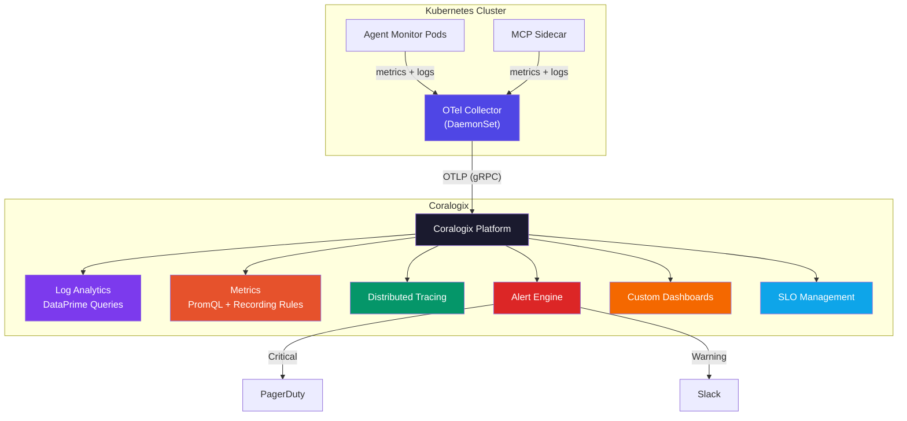

# Coralogix Integration

Full-stack observability for Claude Code Agent Monitor via [Coralogix](https://coralogix.com) — logs, metrics, traces, and SLO tracking through a single platform.

## Architecture



## Files

| File | Purpose |
|------|---------|
| `values.yaml` | Helm values for Coralogix OpenTelemetry Collector |
| `alerts.yaml` | Alert definitions (mirrors Prometheus/Alertmanager rules) |
| `dashboards.yaml` | Custom dashboard with 6 rows, 18 panels, SLO tracking |
| `coralogix-terraform.tf` | Terraform-managed alerts, parsing rules, recording rules |

## Quick Start

### 1. Add the Helm Repository

```bash
helm repo add coralogix https://cgx.jfrog.io/artifactory/coralogix-charts-virtual
helm repo update
```

### 2. Create the API Key Secret

```bash
kubectl create secret generic coralogix-keys \
  --namespace agent-monitor \
  --from-literal=PRIVATE_KEY=<YOUR_CORALOGIX_SEND_YOUR_DATA_KEY>
```

### 3. Deploy the OTel Collector

```bash
helm install coralogix-otel coralogix/opentelemetry \
  --namespace agent-monitor \
  -f deployments/monitoring/coralogix/values.yaml
```

### 4. Import the Dashboard

Upload `dashboards.yaml` via the Coralogix UI:

**Dashboards → Custom Dashboards → Import**

### 5. (Optional) Terraform-managed Alerts

```bash
cd deployments/monitoring/coralogix
export CORALOGIX_API_KEY="<your-key>"
export CORALOGIX_ENV="coralogix.com"
terraform init
terraform apply
```

## What Gets Collected

| Signal | Source | Destination |
|--------|--------|-------------|
| **Logs** | Pod stdout/stderr (JSON structured) | Coralogix Log Analytics |
| **Metrics** | Prometheus scrape (`/api/health`) | Coralogix Metrics |
| **K8s Metrics** | kubelet, cAdvisor, host metrics | Coralogix Metrics |
| **Traces** | OTLP from application (if instrumented) | Coralogix Tracing |

## Alert Parity

All 10 Prometheus/Alertmanager rules are replicated in Coralogix:

| Alert | Severity | Prometheus | Coralogix |
|-------|----------|:----------:|:---------:|
| Instance Down | Critical | ✓ | ✓ |
| High Error Rate | Critical | ✓ | ✓ |
| Pod Restart Loop | Critical | ✓ | ✓ |
| PV Nearly Full | Critical | ✓ | ✓ |
| High Latency | Warning | ✓ | ✓ |
| WebSocket Spike | Warning | ✓ | ✓ |
| High Memory | Warning | ✓ | ✓ |
| High CPU | Warning | ✓ | ✓ |
| HPA Maxed Out | Warning | ✓ | ✓ |
| Slow DB Queries | Warning | ✓ | ✓ |

## Dashboard Panels

The custom dashboard provides 18 panels across 6 rows:

1. **Overview** — Active sessions, request rate, WebSocket connections
2. **HTTP Performance** — Latency distribution, error rate, status codes
3. **Application Logs** — Error log stream (DataPrime), log volume by severity, hook throughput
4. **Infrastructure** — CPU, memory, pod status
5. **Database & Storage** — SQLite query duration, PV usage, network I/O
6. **SLO Tracking** — Availability SLO (99.9%), latency SLO (P95 < 500ms), error budget burn

## Coralogix Regions

Set `global.domain` in `values.yaml` to match your Coralogix region:

| Region | Domain |
|--------|--------|
| US1 | `coralogix.us` |
| US2 | `cx498.coralogix.com` |
| EU1 | `coralogix.com` |
| EU2 | `eu2.coralogix.com` |
| AP1 (India) | `coralogix.in` |
| AP2 (Singapore) | `coralogix.sg` |
