# Deployment Guide

Enterprise deployment strategies for Agent Dashboard across development, staging, and production environments.

---

## Table of Contents

- [Overview](#overview)
- [Deployment Architecture](#deployment-architecture)
- [Local Development](#local-development)
- [Production Deployment](#production-deployment)
- [Docker Deployment](#docker-deployment)
- [Cloud Deployment](#cloud-deployment)
- [Process Management](#process-management)
- [Monitoring & Logging](#monitoring--logging)
- [Backup & Recovery](#backup--recovery)
- [Security Hardening](#security-hardening)
- [Performance Tuning](#performance-tuning)
- [Troubleshooting](#troubleshooting)

---

## Overview

Agent Dashboard supports multiple deployment modes:

- **Local Development** - Hot reload for rapid iteration
- **Docker** - Containerized deployment with Docker/Podman
- **PM2** - Process management for production
- **Systemd** - System service on Linux
- **Cloud** - Deploy to AWS, Azure, GCP, or other cloud providers

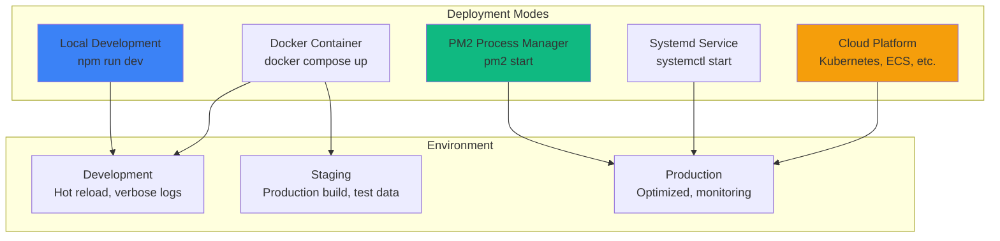

---

## Deployment Architecture

### Single-Server Architecture

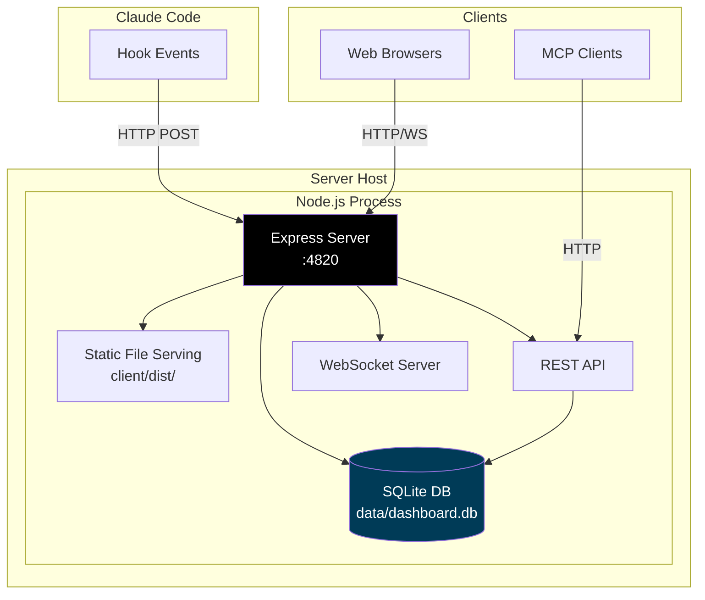

### High-Availability Architecture

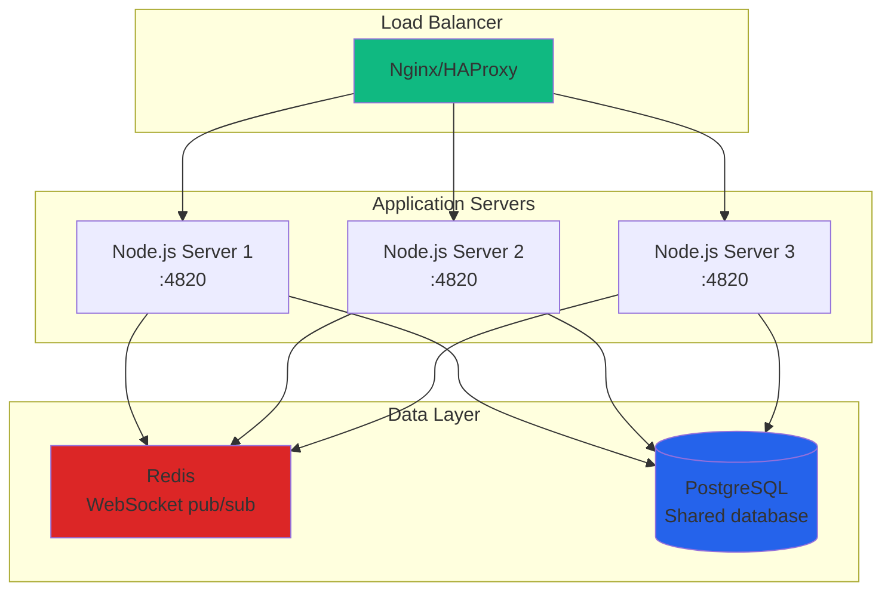

---

## Local Development

### Prerequisites

- Node.js >= 18.0.0
- npm >= 9.0.0

### Setup

```bash
# Clone repository
git clone https://github.com/your-org/agent-dashboard.git
cd agent-dashboard

# Install dependencies
npm run setup

# Start development servers
npm run dev
```

### Development Architecture

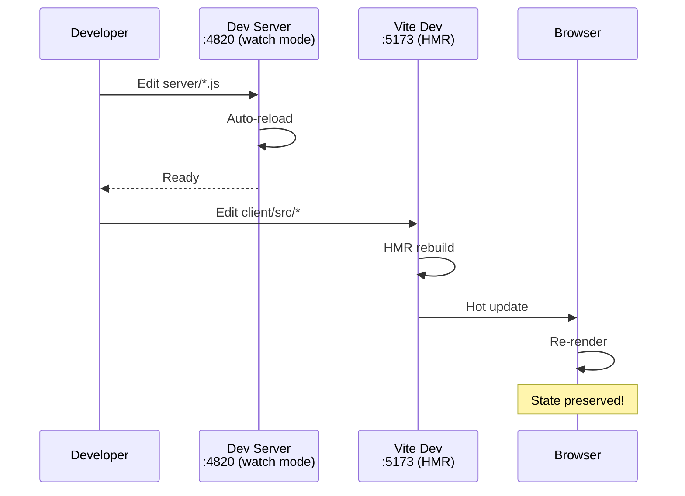

### Running Components Separately

```bash
# Terminal 1: Server only
npm run dev:server

# Terminal 2: Client only
npm run dev:client

# Terminal 3: MCP server (optional)
npm run mcp:dev
```

---

## Production Deployment

### Build Process

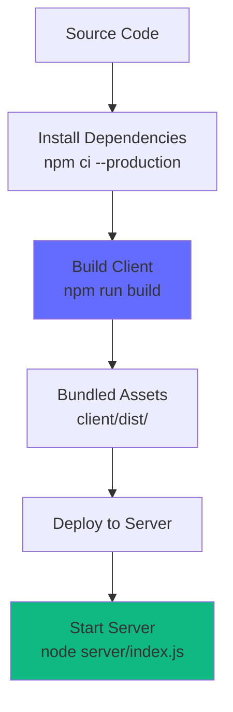

### Production Checklist

```bash
# 1. Install dependencies (production only)
npm ci --production
cd client && npm ci --production && cd ..

# 2. Build client
npm run build

# 3. Set environment variables
export NODE_ENV=production
export PORT=4820
export DASHBOARD_DB_PATH=/var/lib/agent-dashboard/dashboard.db

# 4. Create data directory
mkdir -p /var/lib/agent-dashboard

# 5. Start server
node server/index.js
```

### Environment Variables

```bash
# Server
PORT=4820                              # Server port
NODE_ENV=production                    # Environment mode
CORS_ORIGIN=*                          # CORS allowed origins

# Database
DASHBOARD_DB_PATH=/var/lib/agent-dashboard/dashboard.db

# Logging
LOG_LEVEL=info                         # debug | info | warn | error
```

---

## Docker Deployment

### Docker Compose (Recommended)

```yaml
# docker-compose.yml
version: '3.8'

services:
  agent-dashboard:
    build: .
    ports:
      - "4820:4820"
    volumes:
      - ./data:/app/data
    environment:
      - NODE_ENV=production
      - PORT=4820
    restart: unless-stopped
    healthcheck:
      test: ["CMD", "curl", "-f", "http://localhost:4820/api/sessions"]
      interval: 30s
      timeout: 10s
      retries: 3
      start_period: 40s
```

### Build & Run

```bash
# Build image
docker compose build

# Start container
docker compose up -d

# View logs
docker compose logs -f

# Stop container
docker compose down
```

### Multi-Stage Dockerfile

```dockerfile
# Build stage
FROM node:18-alpine AS builder

WORKDIR /app

# Install dependencies
COPY package*.json ./
COPY client/package*.json ./client/
RUN npm ci && cd client && npm ci

# Build client
COPY client ./client
RUN cd client && npm run build

# Production stage
FROM node:18-alpine

WORKDIR /app

# Copy built artifacts
COPY --from=builder /app/client/dist ./client/dist
COPY --from=builder /app/node_modules ./node_modules
COPY server ./server
COPY package.json ./

# Create data directory
RUN mkdir -p /app/data

EXPOSE 4820

HEALTHCHECK --interval=30s --timeout=10s --start-period=40s --retries=3 \
  CMD node -e "require('http').get('http://localhost:4820/api/sessions', (res) => process.exit(res.statusCode === 200 ? 0 : 1))"

CMD ["node", "server/index.js"]
```

### Container Architecture

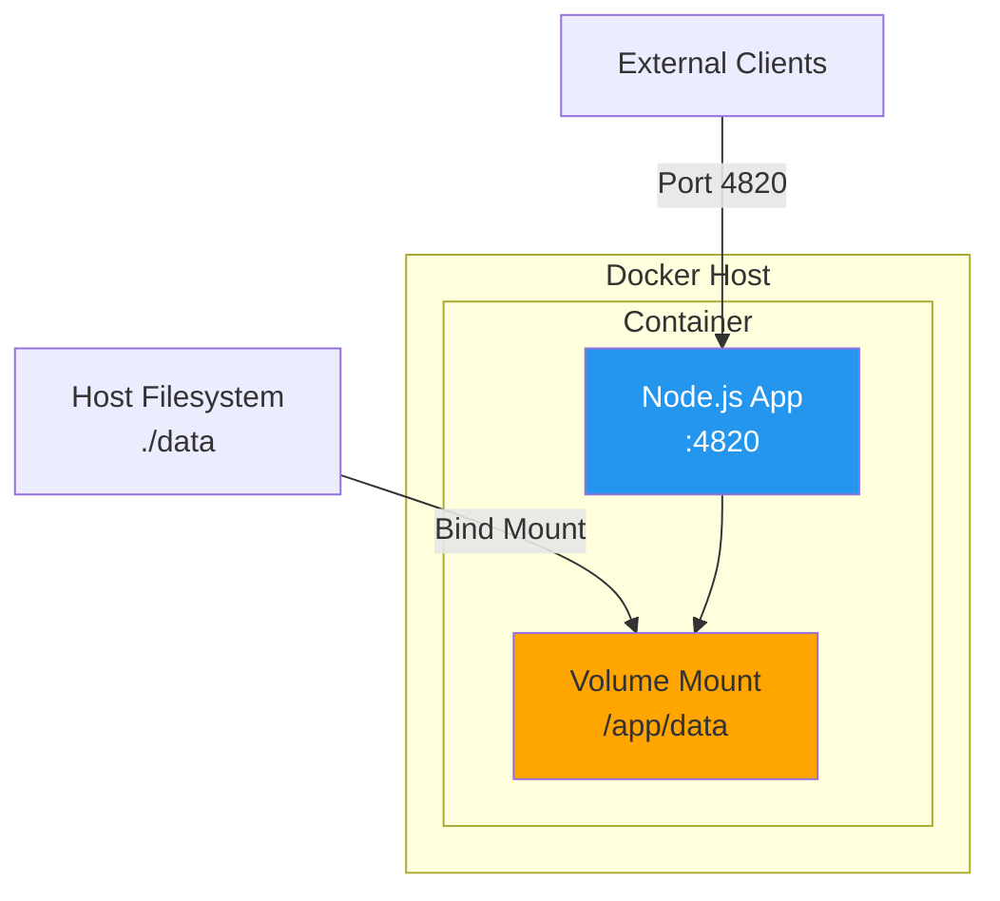

---

## Cloud Deployment

### AWS (Elastic Beanstalk)

```bash
# Install EB CLI
pip install awsebcli

# Initialize
eb init -p node.js agent-dashboard

# Create environment
eb create production

# Deploy
eb deploy

# Open in browser
eb open
```

### Kubernetes

```yaml
# k8s/deployment.yaml
apiVersion: apps/v1
kind: Deployment
metadata:
  name: agent-dashboard
spec:
  replicas: 3
  selector:
    matchLabels:
      app: agent-dashboard
  template:
    metadata:
      labels:
        app: agent-dashboard
    spec:
      containers:
      - name: agent-dashboard
        image: agent-dashboard:latest
        ports:
        - containerPort: 4820
        env:
        - name: NODE_ENV
          value: "production"
        volumeMounts:
        - name: data
          mountPath: /app/data
      volumes:
      - name: data
        persistentVolumeClaim:
          claimName: agent-dashboard-pvc

---
apiVersion: v1
kind: Service
metadata:
  name: agent-dashboard
spec:
  selector:
    app: agent-dashboard
  ports:
  - protocol: TCP
    port: 80
    targetPort: 4820
  type: LoadBalancer
```

### Kubernetes Architecture

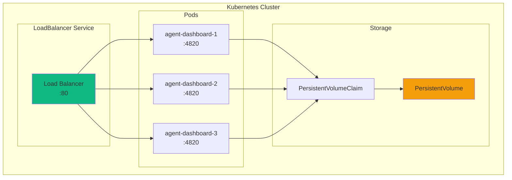

---

## Process Management

### PM2 (Production Process Manager)

```bash
# Install PM2
npm install -g pm2

# Start application
pm2 start server/index.js --name agent-dashboard

# Start with environment
pm2 start server/index.js --name agent-dashboard --env production

# View logs
pm2 logs agent-dashboard

# Monitor
pm2 monit

# Restart
pm2 restart agent-dashboard

# Stop
pm2 stop agent-dashboard

# Auto-start on system boot
pm2 startup
pm2 save
```

### PM2 Ecosystem File

```javascript
// ecosystem.config.js
module.exports = {
  apps: [{
    name: 'agent-dashboard',
    script: './server/index.js',
    instances: 2,
    exec_mode: 'cluster',
    env: {
      NODE_ENV: 'development',
      PORT: 4820
    },
    env_production: {
      NODE_ENV: 'production',
      PORT: 4820,
      DASHBOARD_DB_PATH: '/var/lib/agent-dashboard/dashboard.db'
    },
    max_memory_restart: '500M',
    error_file: '/var/log/agent-dashboard/error.log',
    out_file: '/var/log/agent-dashboard/out.log',
    time: true
  }]
};
```

```bash
# Start with ecosystem file
pm2 start ecosystem.config.js --env production
```

### Systemd Service (Linux)

```ini
# /etc/systemd/system/agent-dashboard.service
[Unit]
Description=Agent Dashboard
After=network.target

[Service]
Type=simple
User=agent-dashboard
WorkingDirectory=/opt/agent-dashboard
Environment=NODE_ENV=production
Environment=PORT=4820
Environment=DASHBOARD_DB_PATH=/var/lib/agent-dashboard/dashboard.db
ExecStart=/usr/bin/node server/index.js
Restart=on-failure
RestartSec=10
StandardOutput=journal
StandardError=journal

[Install]
WantedBy=multi-user.target
```

```bash
# Enable and start service
sudo systemctl enable agent-dashboard
sudo systemctl start agent-dashboard

# Check status
sudo systemctl status agent-dashboard

# View logs
sudo journalctl -u agent-dashboard -f
```

---

## Monitoring & Logging

### Health Checks

```bash
# Server health check
curl http://localhost:4820/api/sessions

# Expected: {"sessions": [...]}
```

### Logging Strategy

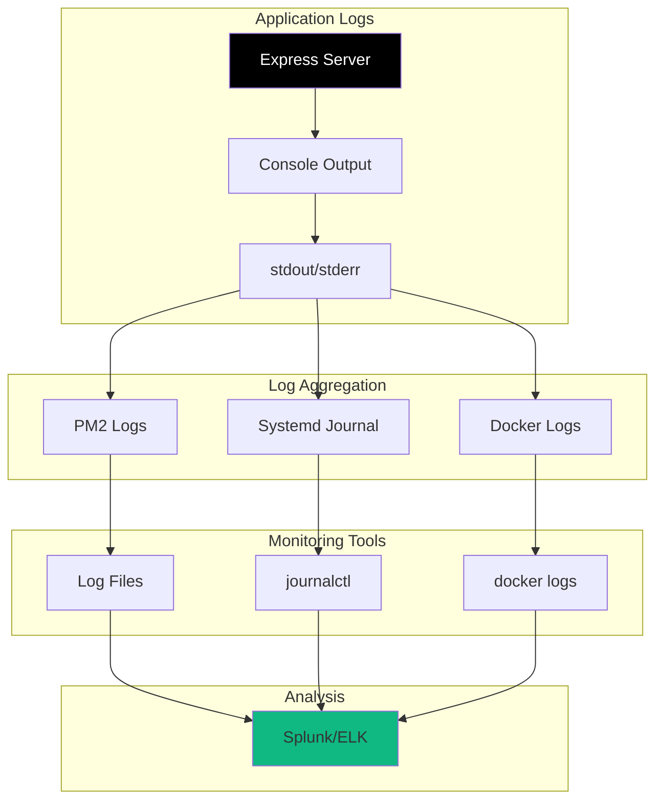

### Monitoring Metrics

```javascript
// Add to server/index.js for metrics endpoint
app.get('/metrics', (req, res) => {
  const metrics = {
    uptime: process.uptime(),
    memory: process.memoryUsage(),
    cpu: process.cpuUsage(),
    sessions: db.prepare('SELECT COUNT(*) as count FROM sessions').get(),
    agents: db.prepare('SELECT COUNT(*) as count FROM agents').get(),
    websocket_clients: wss.clients.size
  };
  res.json(metrics);
});
```

---

## Backup & Recovery

### Backup Strategy

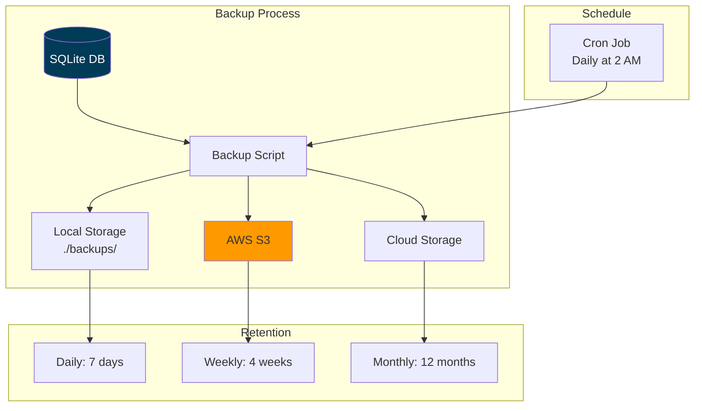

### Backup Script

```bash
#!/bin/bash
# scripts/backup.sh

BACKUP_DIR="/var/backups/agent-dashboard"
DB_PATH="/var/lib/agent-dashboard/dashboard.db"
TIMESTAMP=$(date +%Y%m%d_%H%M%S)
BACKUP_FILE="$BACKUP_DIR/dashboard_$TIMESTAMP.db"

# Create backup directory
mkdir -p "$BACKUP_DIR"

# Create backup (online backup with VACUUM INTO)
sqlite3 "$DB_PATH" "VACUUM INTO '$BACKUP_FILE'"

# Compress backup
gzip "$BACKUP_FILE"

# Upload to S3 (optional)
aws s3 cp "$BACKUP_FILE.gz" s3://my-backups/agent-dashboard/

# Delete old backups (keep last 7 days)
find "$BACKUP_DIR" -name "dashboard_*.db.gz" -mtime +7 -delete

echo "Backup completed: $BACKUP_FILE.gz"
```

### Restore Process

```bash
#!/bin/bash
# scripts/restore.sh

BACKUP_FILE=$1
DB_PATH="/var/lib/agent-dashboard/dashboard.db"

if [ -z "$BACKUP_FILE" ]; then
  echo "Usage: ./restore.sh <backup_file.db.gz>"
  exit 1
fi

# Stop application
systemctl stop agent-dashboard

# Decompress backup
gunzip -c "$BACKUP_FILE" > /tmp/restore.db

# Restore database
cp /tmp/restore.db "$DB_PATH"
chown agent-dashboard:agent-dashboard "$DB_PATH"

# Start application
systemctl start agent-dashboard

echo "Restore completed from $BACKUP_FILE"
```

---

## Security Hardening

### Security Checklist

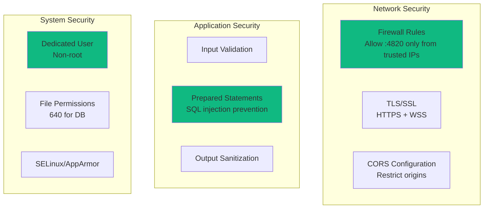

### TLS Configuration (Nginx Reverse Proxy)

```nginx
# /etc/nginx/sites-available/agent-dashboard
server {
    listen 443 ssl http2;
    server_name dashboard.example.com;
    
    ssl_certificate /etc/letsencrypt/live/dashboard.example.com/fullchain.pem;
    ssl_certificate_key /etc/letsencrypt/live/dashboard.example.com/privkey.pem;
    ssl_protocols TLSv1.2 TLSv1.3;
    ssl_ciphers HIGH:!aNULL:!MD5;
    
    location / {
        proxy_pass http://localhost:4820;
        proxy_http_version 1.1;
        proxy_set_header Upgrade $http_upgrade;
        proxy_set_header Connection "upgrade";
        proxy_set_header Host $host;
        proxy_set_header X-Real-IP $remote_addr;
        proxy_set_header X-Forwarded-For $proxy_add_x_forwarded_for;
        proxy_set_header X-Forwarded-Proto $scheme;
    }
    
    location /ws {
        proxy_pass http://localhost:4820/ws;
        proxy_http_version 1.1;
        proxy_set_header Upgrade $http_upgrade;
        proxy_set_header Connection "upgrade";
    }
}

# Redirect HTTP to HTTPS
server {
    listen 80;
    server_name dashboard.example.com;
    return 301 https://$server_name$request_uri;
}
```

---

## Performance Tuning

### Node.js Optimization

```bash
# Increase memory limit
NODE_OPTIONS="--max-old-space-size=4096" node server/index.js

# Enable V8 optimizations
node --optimize-for-size server/index.js
```

### SQLite Tuning

```javascript
// server/db.js - Add these pragmas
db.pragma('journal_mode = WAL');       // Write-Ahead Logging
db.pragma('synchronous = NORMAL');     // Faster writes
db.pragma('cache_size = -64000');      // 64MB cache
db.pragma('temp_store = MEMORY');      // Temp tables in memory
db.pragma('mmap_size = 30000000000');  // Memory-mapped I/O
db.pragma('page_size = 4096');         // Optimal page size
```

### Nginx Tuning

```nginx
# /etc/nginx/nginx.conf
worker_processes auto;
worker_connections 4096;

http {
    # Enable compression
    gzip on;
    gzip_comp_level 6;
    gzip_types text/plain text/css application/json application/javascript;
    
    # Client body buffer
    client_body_buffer_size 128k;
    
    # Keepalive
    keepalive_timeout 65;
    keepalive_requests 100;
    
    # Proxy buffering
    proxy_buffering on;
    proxy_buffer_size 4k;
    proxy_buffers 8 4k;
}
```

---

## Troubleshooting

### Common Issues

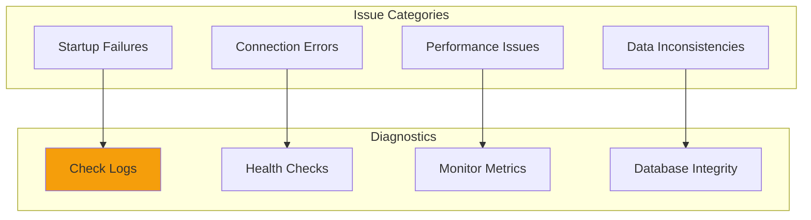

### Issue Resolution Guide

| Issue | Symptoms | Solution |
|-------|----------|----------|
| Port already in use | `EADDRINUSE: address already in use :::4820` | `lsof -i :4820` then kill process |
| Database locked | `database is locked` | Check for long-running queries, increase timeout |
| WebSocket connection fails | Clients can't connect | Check firewall, verify WebSocket upgrade headers |
| High memory usage | >500MB RAM | Enable memory limits, check for leaks |
| Slow queries | API responses >100ms | Add indexes, use EXPLAIN QUERY PLAN |

### Debug Mode

```bash
# Enable verbose logging
DEBUG=* node server/index.js

# SQLite query logging
NODE_ENV=development node server/index.js
```

---

## Summary

This deployment guide covers:

- ✅ **Multiple deployment modes** - Local, Docker, PM2, Systemd, Cloud
- ✅ **Production best practices** - Environment variables, health checks, logging
- ✅ **Process management** - PM2, systemd service files
- ✅ **Monitoring & logging** - Metrics endpoint, log aggregation
- ✅ **Backup & recovery** - Automated backups, restore procedures
- ✅ **Security hardening** - TLS, CORS, firewall rules
- ✅ **Performance tuning** - Node.js, SQLite, Nginx optimizations
- ✅ **Troubleshooting** - Common issues and resolutions

For architecture details, see [ARCHITECTURE.md](../ARCHITECTURE.md).
