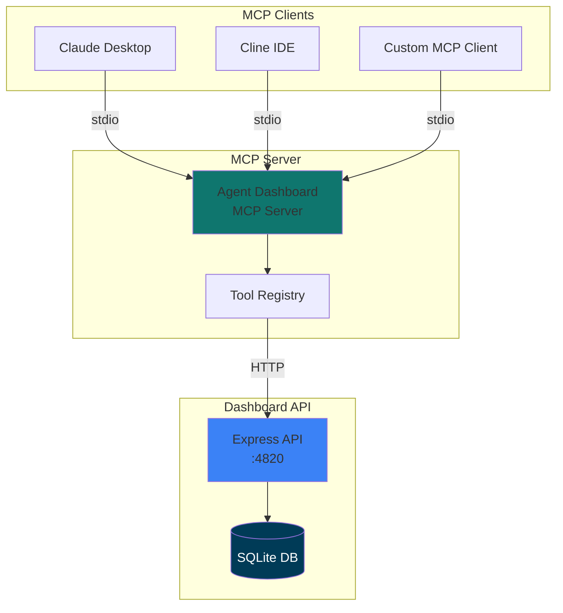
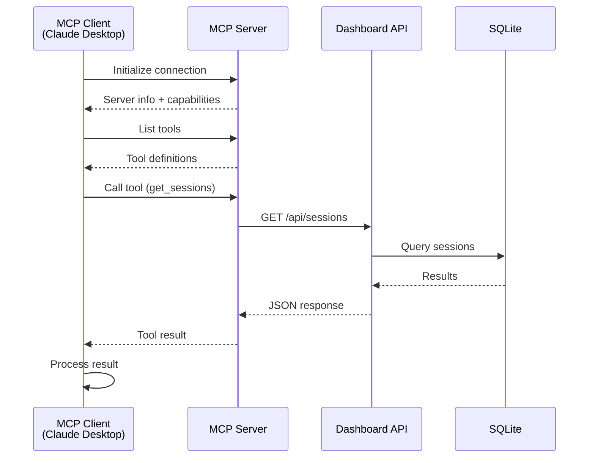
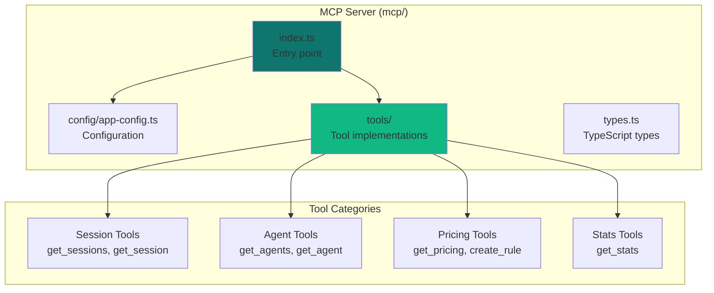
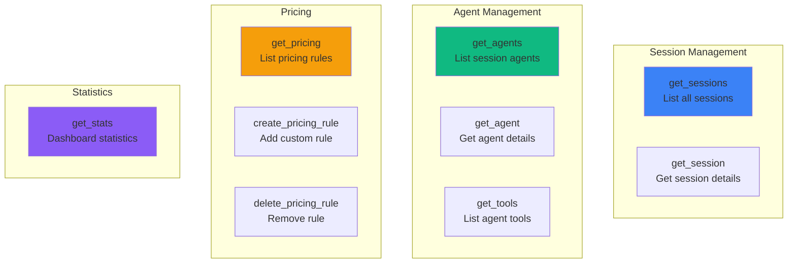
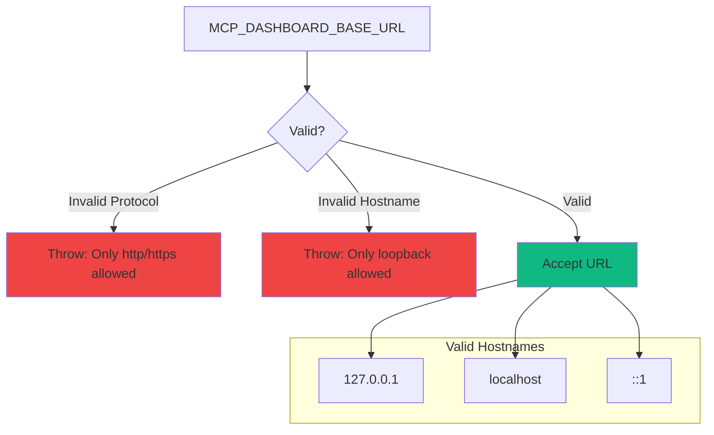
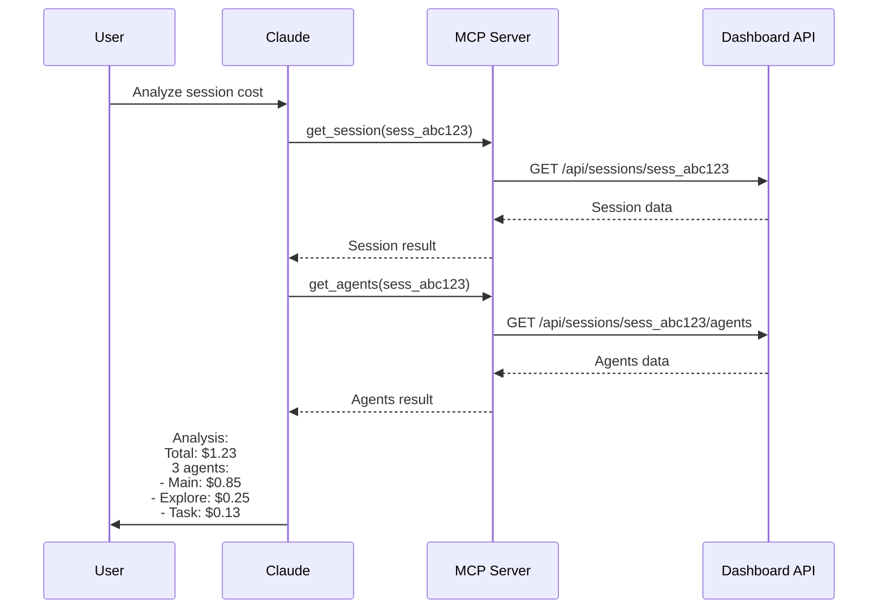
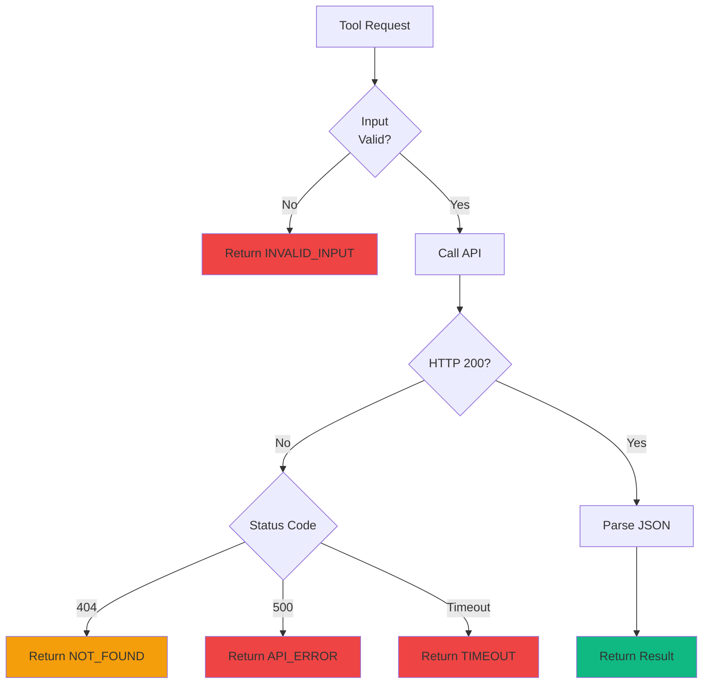
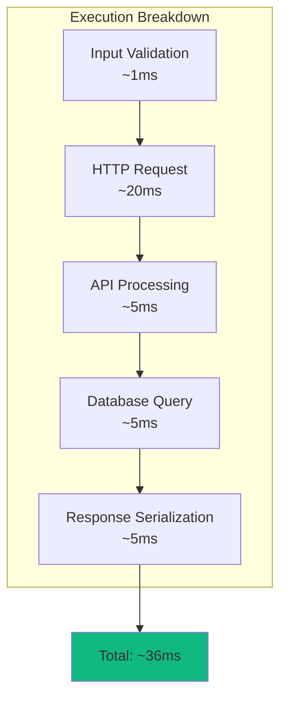

# MCP Integration Guide

Model Context Protocol (MCP) server integration for programmatic dashboard access.

---

## Table of Contents

- [Overview](#overview)
- [MCP Architecture](#mcp-architecture)
- [Setup & Installation](#setup--installation)
- [Available Tools](#available-tools)
- [Client Configuration](#client-configuration)
- [Usage Examples](#usage-examples)
- [Tool Reference](#tool-reference)
- [Error Handling](#error-handling)
- [Performance](#performance)
- [Development](#development)
- [Deployment](#deployment)

---

## Overview

The Agent Dashboard MCP server exposes dashboard functionality as tools that can be used by Claude Desktop, Cline, and other MCP clients.



**Key Benefits:**

- 🤖 **AI-Native** - Claude can query sessions, agents, and costs
- 🔌 **Standardized** - Works with any MCP-compatible client
- 🚀 **Easy Setup** - One-command installation
- 🔒 **Local-First** - No cloud dependencies

---

## MCP Architecture

### MCP Protocol Flow



### MCP Server Structure



---

## Setup & Installation

### Prerequisites

- Node.js >= 18.0.0
- Dashboard server running on `localhost:4820`

### Installation

```bash
# Install MCP server dependencies
npm run mcp:install

# Build MCP server
npm run mcp:build

# Test MCP server
npm run mcp:start
```

### Directory Structure

```
mcp/
├── src/
│   ├── index.ts              # MCP server entry point
│   ├── config/
│   │   └── app-config.ts     # Configuration + validation
│   ├── tools/
│   │   ├── sessions.ts       # Session-related tools
│   │   ├── agents.ts         # Agent-related tools
│   │   ├── pricing.ts        # Pricing management tools
│   │   └── stats.ts          # Statistics tools
│   └── types.ts              # TypeScript type definitions
│
├── dist/                     # Compiled JavaScript (gitignored)
├── package.json
├── tsconfig.json
└── README.md
```

---

## Available Tools

### Tool Catalog



---

## Client Configuration

### Claude Desktop

Add to `~/Library/Application Support/Claude/claude_desktop_config.json` (macOS):

```json
{
  "mcpServers": {
    "agent-dashboard": {
      "command": "node",
      "args": ["/path/to/agent-dashboard/mcp/dist/index.js"],
      "env": {
        "MCP_DASHBOARD_BASE_URL": "http://localhost:4820"
      }
    }
  }
}
```

**Linux:**
```
~/.config/Claude/claude_desktop_config.json
```

**Windows:**
```
%APPDATA%\Claude\claude_desktop_config.json
```

### Cline (VS Code Extension)

Add to VS Code settings (`.vscode/settings.json`):

```json
{
  "cline.mcpServers": {
    "agent-dashboard": {
      "command": "node",
      "args": ["/path/to/agent-dashboard/mcp/dist/index.js"],
      "env": {
        "MCP_DASHBOARD_BASE_URL": "http://localhost:4820"
      }
    }
  }
}
```

### Environment Variables

| Variable | Default | Description |
|----------|---------|-------------|
| `MCP_DASHBOARD_BASE_URL` | `http://localhost:4820` | Dashboard API base URL |

**URL Validation:**



---

## Usage Examples

### Example 1: List Recent Sessions

**User Prompt:**
> "Show me the 5 most recent Claude Code sessions"

**Tool Call:**
```json
{
  "name": "get_sessions",
  "arguments": {
    "limit": 5
  }
}
```

**Response:**
```json
{
  "sessions": [
    {
      "session_id": "sess_abc123",
      "model": "claude-sonnet-4",
      "status": "active",
      "total_cost": 1.23,
      "agent_count": 3,
      "tool_count": 12,
      "created_at": "2024-03-18T12:00:00Z"
    }
  ]
}
```

---

### Example 2: Analyze Session Cost

**User Prompt:**
> "What was the cost breakdown for session sess_abc123?"

**Tool Sequence:**



---

### Example 3: Create Custom Pricing Rule

**User Prompt:**
> "Add a pricing rule for my-custom-model with input $5/1M and output $20/1M"

**Tool Call:**
```json
{
  "name": "create_pricing_rule",
  "arguments": {
    "pattern": "my-custom-model",
    "input_cost_per_1m": 5.0,
    "output_cost_per_1m": 20.0
  }
}
```

**Response:**
```json
{
  "rule": {
    "id": 10,
    "pattern": "my-custom-model",
    "input_cost_per_1m": 5.0,
    "output_cost_per_1m": 20.0,
    "created_at": "2024-03-18T14:30:00Z"
  }
}
```

---

## Tool Reference

### get_sessions

List all sessions with optional filters.

**Input Schema:**
```typescript
{
  limit?: number;      // Max sessions to return (1-1000)
  status?: 'active' | 'completed';
}
```

**Output Schema:**
```typescript
{
  sessions: Session[];
  total: number;
}

interface Session {
  session_id: string;
  model: string;
  status: 'active' | 'completed';
  total_cost: number;
  agent_count: number;
  tool_count: number;
  created_at: string;
  updated_at: string;
}
```

---

### get_session

Get single session details.

**Input Schema:**
```typescript
{
  session_id: string;  // Required
}
```

**Output Schema:**
```typescript
{
  session: Session;
}
```

**Errors:**
- `404` - Session not found

---

### get_agents

List agents for a session.

**Input Schema:**
```typescript
{
  session_id: string;  // Required
}
```

**Output Schema:**
```typescript
{
  agents: Agent[];
}

interface Agent {
  agent_id: string;
  session_id: string;
  agent_type: string;
  status: 'running' | 'completed' | 'failed';
  current_tool: string | null;
  input_tokens: number;
  output_tokens: number;
  cost: number;
  tool_count: number;
  created_at: string;
  updated_at: string;
}
```

---

### get_agent

Get single agent details.

**Input Schema:**
```typescript
{
  agent_id: string;  // Required
}
```

**Output Schema:**
```typescript
{
  agent: Agent;
}
```

**Errors:**
- `404` - Agent not found

---

### get_tools

List tool executions for an agent.

**Input Schema:**
```typescript
{
  agent_id: string;  // Required
}
```

**Output Schema:**
```typescript
{
  tools: ToolExecution[];
}

interface ToolExecution {
  id: number;
  agent_id: string;
  tool_name: string;
  duration_ms: number;
  success: boolean;
  error_message: string | null;
  created_at: string;
}
```

---

### get_pricing

List pricing rules.

**Input Schema:**
```typescript
{} // No parameters
```

**Output Schema:**
```typescript
{
  rules: PricingRule[];
}

interface PricingRule {
  id: number;
  pattern: string;
  input_cost_per_1m: number;
  output_cost_per_1m: number;
  is_default: boolean;
  created_at: string;
}
```

---

### create_pricing_rule

Create custom pricing rule.

**Input Schema:**
```typescript
{
  pattern: string;             // Model pattern
  input_cost_per_1m: number;   // USD per 1M input tokens
  output_cost_per_1m: number;  // USD per 1M output tokens
}
```

**Output Schema:**
```typescript
{
  rule: PricingRule;
}
```

**Errors:**
- `400` - Invalid input
- `409` - Pattern already exists

---

### delete_pricing_rule

Delete pricing rule.

**Input Schema:**
```typescript
{
  pattern: string;  // Pattern to delete
}
```

**Output Schema:**
```typescript
{
  deleted: true;
}
```

**Errors:**
- `404` - Pattern not found
- `403` - Cannot delete default rule

---

### get_stats

Get dashboard statistics.

**Input Schema:**
```typescript
{} // No parameters
```

**Output Schema:**
```typescript
{
  total_sessions: number;
  active_sessions: number;
  total_agents: number;
  total_tools: number;
  total_cost: number;
  avg_session_cost: number;
}
```

---

## Error Handling

### Error Response Format

```typescript
interface MCPError {
  code: string;
  message: string;
  details?: any;
}
```

### Error Codes

| Code | Description | Resolution |
|------|-------------|------------|
| `INVALID_INPUT` | Invalid tool arguments | Check input schema |
| `API_ERROR` | Dashboard API error | Check server is running |
| `NOT_FOUND` | Resource not found | Verify ID exists |
| `TIMEOUT` | Request timeout | Increase timeout, check network |
| `CONFIG_ERROR` | Invalid configuration | Check `MCP_DASHBOARD_BASE_URL` |

### Error Handling Flow



---

## Performance

### Tool Execution Time



**Performance Benchmarks:**

| Tool | Avg Time | 95th Percentile |
|------|----------|-----------------|
| `get_sessions` | 25ms | 40ms |
| `get_session` | 15ms | 25ms |
| `get_agents` | 20ms | 35ms |
| `get_tools` | 30ms | 50ms |
| `get_pricing` | 10ms | 20ms |
| `get_stats` | 40ms | 60ms |

---

## Development

### Building from Source

```bash
# Install dependencies
cd mcp && npm install

# Build TypeScript
npm run build

# Watch mode (auto-rebuild)
npm run dev

# Type checking
npm run typecheck
```

### Adding New Tools

```typescript
// mcp/src/tools/my-tool.ts

import { z } from 'zod';
import { fetchFromAPI } from '../utils';

export const myTool = {
  name: 'my_tool',
  description: 'Description of what this tool does',
  inputSchema: z.object({
    param1: z.string(),
    param2: z.number().optional()
  }),
  
  async execute(args: { param1: string; param2?: number }) {
    const response = await fetchFromAPI(`/api/my-endpoint?param=${args.param1}`);
    return response.data;
  }
};
```

Register in `index.ts`:

```typescript
import { myTool } from './tools/my-tool';

server.setRequestHandler(CallToolRequestSchema, async (request) => {
  switch (request.params.name) {
    case 'my_tool':
      return await myTool.execute(request.params.arguments);
    // ... other tools
  }
});
```

---

## Deployment

### Docker Deployment

```dockerfile
# mcp/Dockerfile
FROM node:18-alpine

WORKDIR /app

# Install dependencies
COPY package*.json ./
RUN npm ci --production

# Copy built files
COPY dist ./dist

CMD ["node", "dist/index.js"]
```

```bash
# Build Docker image
npm run mcp:docker:build

# Run container
docker run -e MCP_DASHBOARD_BASE_URL=http://localhost:4820 agent-dashboard-mcp:local
```

### Podman Deployment

```bash
# Build with Podman
npm run mcp:podman:build

# Run with Podman
podman run -e MCP_DASHBOARD_BASE_URL=http://localhost:4820 localhost/agent-dashboard-mcp:local
```

---

## Summary

The MCP server provides:

- ✅ **AI-native interface** - Claude can query dashboard data naturally
- ✅ **Complete tool coverage** - Sessions, agents, tools, pricing, stats
- ✅ **Type-safe** - Full TypeScript types with Zod validation
- ✅ **Standards-compliant** - Implements MCP protocol specification
- ✅ **Easy setup** - One-command installation and configuration
- ✅ **Local-first** - No cloud dependencies, runs entirely locally
- ✅ **Docker-ready** - Containerized deployment support

For API details, see [docs/API.md](./API.md).
