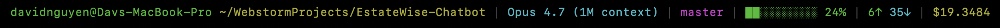

# Claude Code Statusline

A color-coded statusline for Claude Code showing model, user, working directory, git branch, context window usage, token counts, and session cost.

## Preview

Example statusline with all segments visible in a git repo and 24% context window usage:

<p align="center">
  
</p>

| Segment     | Color                | Example                                            |
| ----------- | -------------------- | -------------------------------------------------- |
| Model       | Cyan                 | `Sonnet 4.6`                                       |
| User        | Green                | `nguyens6`                                         |
| CWD         | Yellow               | `~/agent-dashboard/client`                         |
| Git branch  | Magenta              | `main` (hidden outside git repos)                  |
| Context bar | Green → Yellow → Red | `████████░░ 79%`                                   |
| Tokens      | Green / Cyan / Dim   | `3↑ 2↓ 156586c` (green `↑` in, cyan `↓` out, dim `c` cache reads) |
| Cost (USD)  | Green → Yellow → Red | `$0.4231` (session total — shown on API and subscription plans)        |

Context bar color thresholds:

- **Green** — under 50% used
- **Yellow** — 50–79% used
- **Red** — 80%+ used

Cost color thresholds:

- **Green** — under $5
- **Yellow** — $5–$20
- **Red** — $20+

## Requirements

- Python 3.6+
- Git (for branch detection)
- Claude Code 2.x+

## Installation

**1. Copy both files into your Claude config directory:**

```bash
# macOS / Linux
cp statusline.py ~/.claude/statusline.py
cp statusline-command.sh ~/.claude/statusline-command.sh
chmod +x ~/.claude/statusline-command.sh

# Windows (Git Bash)
cp statusline.py "$HOME/.claude/statusline.py"
cp statusline-command.sh "$HOME/.claude/statusline-command.sh"
```

**2. Update the path in `statusline-command.sh`:**

Open `~/.claude/statusline-command.sh` and replace the path with your own home directory:

```bash
#!/usr/bin/env bash
PYTHONUTF8=1 python3 "/your/home/.claude/statusline.py"
```

On Windows this looks like:

```bash
#!/usr/bin/env bash
PYTHONUTF8=1 python3 "C:/Users/YOUR_USERNAME/.claude/statusline.py"
```

On macOS/Linux:

```bash
#!/usr/bin/env bash
python3 "$HOME/.claude/statusline.py"
```

**3. Add to `~/.claude/settings.json`:**

```json
{
  "statusLine": {
    "type": "command",
    "command": "bash \"/path/to/home/.claude/statusline-command.sh\""
  }
}
```

Windows example:

```json
{
  "statusLine": {
    "type": "command",
    "command": "bash \"C:/Users/YOUR_USERNAME/.claude/statusline-command.sh\""
  }
}
```

macOS/Linux example:

```json
{
  "statusLine": {
    "type": "command",
    "command": "bash \"/home/YOUR_USERNAME/.claude/statusline-command.sh\""
  }
}
```

**4. Restart Claude Code** — fully exit and relaunch. Claude Code does not hot-reload `settings.json`, so the new statusline will not show up until the process is restarted.

## Troubleshooting

**The statusline still shows the default (e.g. `[Model] 📁 cwd`) after restarting.**

Claude Code resolves `statusLine` from multiple settings files, in this precedence (later wins):

1. `~/.claude/settings.json` (user, global)
2. `~/.claude/settings.local.json` (user, local — **often overrides the global**)
3. `<project>/.claude/settings.json` (project, shared)
4. `<project>/.claude/settings.local.json` (project, local)

If any of those later files defines its own `statusLine` block, it **replaces** the global one — yours will never run. Grep for it:

```bash
grep -l statusLine ~/.claude/settings*.json $(find . -maxdepth 3 -name 'settings*.json' -path '*.claude*' 2>/dev/null)
```

For each file that defines a competing `statusLine`, either delete that block (to fall back to the global one) or point it at the same script:

```json
{
  "statusLine": {
    "type": "command",
    "command": "bash \"/path/to/home/.claude/statusline-command.sh\""
  }
}
```

**The statusline is blank / missing segments.**

Run the script manually with a sample payload to confirm it works:

```bash
echo '{"model":{"display_name":"Sonnet 4.6"},"workspace":{"current_dir":"'"$HOME"'"},"context_window":{"used_percentage":25,"current_usage":{"input_tokens":1000,"output_tokens":500,"cache_read_input_tokens":200}},"cost":{"total_cost_usd":0.4231}}' \
  | sh ~/.claude/statusline-command.sh
```

If nothing prints, check that `python3` is on your `PATH` and `~/.claude/statusline.py` is readable. The script always exits 0 by design so Claude Code never blocks — errors are silent, so test from the shell first.

## How It Works

Claude Code pipes a JSON object to the statusline command's stdin on each update. The script reads that JSON, extracts the relevant fields, and prints a color-coded string using ANSI escape codes.

Key fields used from the JSON payload:

```json
{
  "model": { "display_name": "Sonnet 4.6" },
  "workspace": { "current_dir": "C:\\Users\\..." },
  "context_window": {
    "used_percentage": 79,
    "current_usage": {
      "input_tokens": 3,
      "output_tokens": 2,
      "cache_read_input_tokens": 156586
    }
  },
  "cost": { "total_cost_usd": 0.4231 }
}
```

## Customization

Edit `statusline.py` directly to change colors, reorder segments, or remove ones you don't want. Each segment is clearly labeled with a comment.

Color constants at the top of the file:

```python
CYAN    = '\033[0;36m'
GREEN   = '\033[0;32m'
YELLOW  = '\033[0;33m'
MAGENTA = '\033[0;35m'
RED     = '\033[0;31m'
DIM     = '\033[2m'
```
