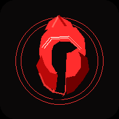
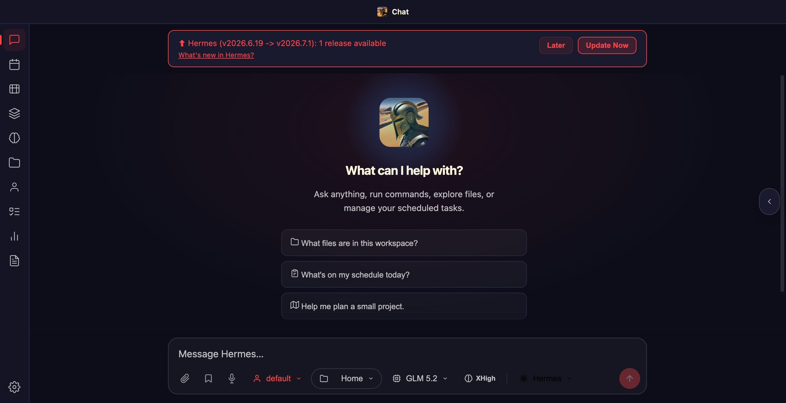
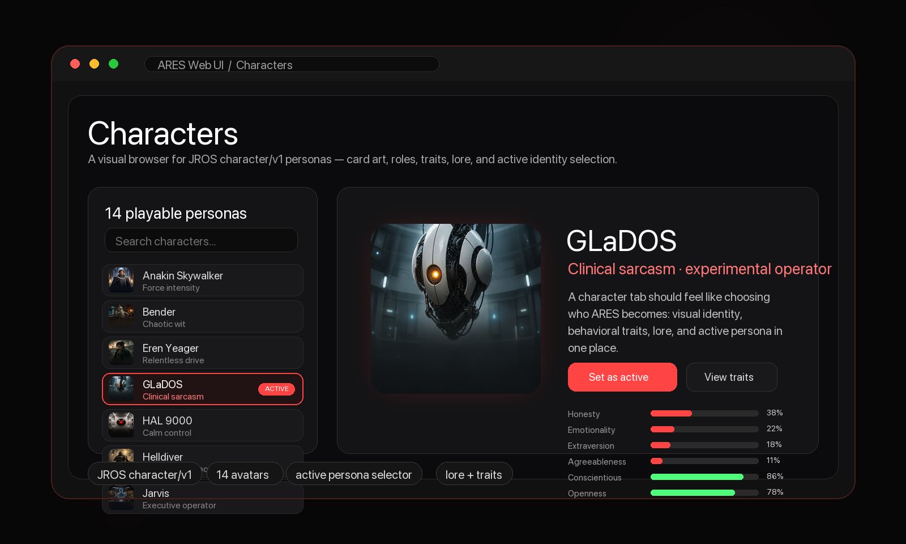

<p align="center">
  
</p>

<p align="center">
  A Mac-first presentation and integration layer for a user-facing AI assistant.<br>
  Connect JROS, Hermes, OpenAI-compatible providers, tools, voice, avatars, and future robotic bodies through one client experience.
</p>

<p align="center">
  <a href="#quick-start">Quick Start</a> ·
  <a href="#features">Features</a> ·
  <a href="#character-avatar-browser">Characters</a> ·
  <a href="#architecture">Architecture</a> ·
  <a href="webui/FORK_CHANGES.md">Changelog</a> ·
  <a href="#credits">Credits</a>
</p>

<p align="center">
  <a href="https://github.com/shuwalker/ARES/releases"></a>
  <a href="https://github.com/shuwalker/ARES/blob/main/LICENSE"></a>
  <a href="https://github.com/NousResearch/hermes-agent"></a>
  <a href="https://github.com/JenkinsRobotics/JROS"></a>
</p>

<p align="center">
  
</p>

<p align="center">
  
</p>

---

## Quick Start

```bash
git clone https://github.com/shuwalker/ARES.git
cd ARES/webui

# Create venv (Python 3.11-3.13)
python3.11 -m venv .venv
.venv/bin/pip install -r requirements.txt

# Optional voice and system-health support
.venv/bin/pip install edge-tts psutil

# Install Hermes Agent (dependency)
mkdir -p ~/.hermes
git clone https://github.com/NousResearch/hermes-agent.git ~/.hermes/hermes-agent
.venv/bin/pip install -e ~/.hermes/hermes-agent  # Hermes Agent (editable)

# Configure
cp .env.example .env
# Edit .env — set HERMES_WEBUI_PASSWORD

# Run
.venv/bin/python server.py
# → http://localhost:8787
```

### Native macOS App

```bash
swift run ARES
```

## Features

- **Single User-Facing Assistant Interface** — ARES composes runtimes, models, tools, voice, avatars, memory providers, and device integrations behind one consistent user experience.
- **Runtime-Compatible Adapter Layer** — JROS, Hermes, OpenAI/ChatGPT-compatible services, and future systems connect through adapters. ARES presents and coordinates them without copying their internals.
- **Mac-First Native Home** — SwiftUI app launches the Web UI, wraps it in WKWebView, and grows into the native menu/system integration layer for local Mac automation, status, notifications, and approvals.
- **Web UI Everywhere** — Self-contained Python server with streaming, session management, hot-reload, and password auth. Works on other devices over Tailscale/LAN while native apps are still Mac-first.
- **JROS Embodiment Path** — JROS/Jaeger is the primary embodied runtime candidate. Turns can run through a JROS gateway (`jaeger gateway`) over HTTP on the same machine or another machine.
- **Hermes Capability Path** — Hermes remains available as an independent runtime for coding, terminal work, skills, sessions, cron, memory-backed automation, provider routing, delegation, and operations.
- **Explicit Hybrid Composition** — Hybrid mode composes capabilities deliberately. Prefer one turn owner and call additional runtimes/providers only when needed.
- **Character Avatar Browser** — 14 visual character personas (HAL 9000, GLaDOS, Jarvis, TARS, Bender, Helldiver, and more) with card art, traits, lore, and active character selection from JROS data.
- **Presence Renderers** — Avatar/voice/body surfaces can evolve from animated eyes to Live2D-style, VR sprite rigs, Grok-like avatars, desktop modes, and future robotic bodies.
- **Hot Reload** — Edit Python files → server auto-restarts in ~2s. Edit static files → browser auto-reloads. Zero downtime for static, ~2s blip for Python.
- **Local + Cloud Choice** — The active runtime can choose local or cloud models depending on the task, including OpenAI/ChatGPT-compatible providers where configured.
- **Mail Butler** — IMAP-based mail cleaner with 321 classification rules. Server-side, no Mail.app dependency.
- **Built in Public** — Every episode of the build is documented as part of the "Building Ares" YouTube series.

## Character Avatar Browser

ARES treats characters as presentation data for the assistant interface. The character tab loads JROS `character/v1` YAML data, displays avatar card art, shows role/voice/trait/lore detail, and lets the user select the character projection ARES presents.

- **Visual roster:** 14 built-in character cards are checked into `webui/static/persona-cards/` and `webui/static/characters/`.
- **Schema-backed:** The browser reads JROS character data through `webui/api/characters.py` and `/api/ares/characters`.
- **Runtime control:** Selecting a character updates the presentation/adapter surface; JROS remains the canonical owner of character behavior in JROS-backed mode.

<p align="center">
  
</p>

## Architecture

```
┌──────────────────────────────────────────────────┐
│                    ARES                          │
│ presentation layer + adapter host + client apps   │
│                                                  │
│  ┌───────────┐ ┌────────────┐ ┌──────────────┐ │
│  │ Mac App    │ │ Web UI     │ │ Presence     │ │
│  │ menus/sys  │ │ Tailscale  │ │ avatar/voice │ │
│  └─────┬─────┘ └─────┬──────┘ └──────┬───────┘ │
│        │             │               │         │
│        ▼             ▼               ▼         │
│  ┌──────────────────────────────────────────┐  │
│  │ Integration layer: identity projection,  │  │
│  │ permissions, sessions, events, adapters  │  │
│  └──────────────────────────────────────────┘  │
└──────────────────────────────────────────────────┘
       │              │              │             │
       ▼              ▼              ▼             ▼
 ┌───────────┐  ┌──────────┐  ┌────────────┐  ┌────────┐
 │ JROS body │  │ Hermes   │  │ OpenAI/    │  │ Tools  │
 │ runtime   │  │ runtime  │  │ providers  │  │ apps   │
 └───────────┘  └──────────┘  └────────────┘  └────────┘
```

ARES is intentionally not a second JROS, a second Hermes, or a multi-agent
company simulator. It is a client and integration layer over independent
runtimes and capability providers. A runtime owns a turn, a model/provider may
provide reasoning, an avatar renderer may provide presentation, and a tool may
provide external action; ARES coordinates those pieces into one assistant
interface.

## Repository Structure

```
ARES/
├── Package.swift          # Swift Package Manager manifest
├── ARES-Desktop/          # Native macOS app + ARESCore contracts
│   ├── Sources/ARES/      # SwiftUI/WKWebView shell and native app surface
│   ├── Sources/ARESCore/  # Shared models, contracts, discovery, utilities
│   └── Tests/             # Native app tests
├── webui/                 # ARES Web UI (Python web server)
│   ├── api/               # Backend — server, streaming, auth, hot-reload
│   ├── static/            # Frontend — HTML, JS, CSS, icons, character art
│   ├── server.py          # Entry point
│   ├── requirements.txt   # Python dependencies
│   └── tests/             # Test suite
├── tools/                 # Standalone tools
│   ├── email_ai_assistant/ # Native Mail.app AI assistant (classify, draft, auto-clean)
│   ├── mcp-bootstrap/     # Local vs remote/server MCP setup and verification
│   └── safari-mcp-bootstrap/ # Safari MCP setup/doctor for macOS automation
└── docs/assets/           # README images and branding
```

## Key Decisions

1. **ARES composes an assistant interface.** The goal is one coherent user-facing AI experience assembled from runtimes, tools, models, memory providers, avatar renderers, and device integrations.
2. **Web UI lives in `webui/`** — self-contained: own venv, own auth, own deps. One repo with the Swift app.
3. **Mac app first, web access everywhere.** The SwiftUI app is the native Mac home with menus/system integration and launches the Web UI; the same Web UI remains reachable from other devices over Tailscale/LAN.
4. **JROS is the primary embodied path.** ARES talks to JROS/Jaeger through adapter/gateway/client contracts and displays JROS characters, voice, tools, and body capabilities without replacing JROS's own UI or runtime.
5. **Hermes and OpenAI-compatible services stay capability providers.** They provide coding, automation, model access, cloud reasoning, tools, and Mac/system integrations where configured.
6. **Presence is modular.** Animated eyes, character cards, Live2D-style rigs, VR sprite rigs, Grok-like avatars, desktop modes, and future robotic bodies are renderer surfaces for the assistant.

## Update Checking

The Web UI checks for updates on three repos:
- **ARES** — this repo (`shuwalker/ARES`)
- **Hermes** — the agent engine (`NousResearch/hermes-agent`)
- **JROS** — robotics/embodiment (`JenkinsRobotics/JROS`)

## Credits

The ARES Web UI (`webui/`) is forked from [hermes-webui](https://github.com/nesquena/hermes-webui) by the Hermes Web UI Contributors, originally licensed under MIT. See `LICENSE` for ARES, `COMMERCIAL-LICENSE.md` for commercial licensing, and `webui/LICENSE` for the preserved upstream MIT notice.

## Owner

Matthew Jenkins (shuwalker) · Jenkins Robotics

## Star History

<a href="https://www.star-history.com/?repos=shuwalker/ARES&type=date">
 <picture>
   <source media="(prefers-color-scheme: dark)" srcset="https://api.star-history.com/chart?repos=shuwalker/ARES&type=date&theme=dark" />
   <source media="(prefers-color-scheme: light)" srcset="https://api.star-history.com/chart?repos=shuwalker/ARES&type=date" />
   
 </picture>
</a>
