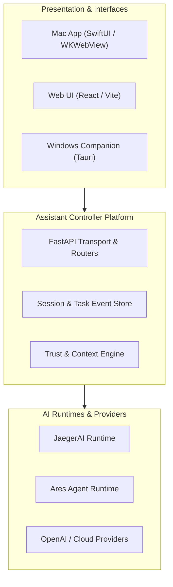

<p align="center">
  <strong style="font-size: 2em;">ARES</strong><br>
  <em>Artificial Reasoning & Execution System</em>
</p>

<p align="center">
  A Mac-first platform hosting a persistent Personal Assistant Engine.<br>
  Maintains user context, protects data privacy, plans daily work,<br>
  delegates to AI runtimes, verifies results, and remains consistent across providers.<br>
</p>

<p align="center">
  <a href="#quick-start">Quick Start</a> ·
  <a href="#features">Features</a> ·
  <a href="#character-avatar-browser">Characters</a> ·
  <a href="#architecture">Architecture</a> ·
  <a href="docs/README.md">Documentation</a> ·
  <a href="#troubleshooting">Troubleshooting</a>
</p>

<p align="center">
  <a href="https://github.com/shuwalker/ARES/blob/main/LICENSE"></a>
  <a href="https://github.com/NousResearch/ares-agent"></a>
  <a href="https://github.com/JenkinsRobotics/JaegerAI"></a>
</p>

---

## Quick Start

### Execution Modes

ARES supports three local execution paths:

- **Developer Mode:** Run `swift run ARES` from the repository root to launch the native macOS shell wrapping the Web UI.
- **Web Standalone Mode:** Run `./start.sh` from the repository root, then navigate to `http://localhost:8788`.
- **Windows Companion Mode:** Launch the Web UI backend, then run `cargo tauri dev` from `ARES-Windows/`.

### Installation

```bash
git clone https://github.com/shuwalker/ARES.git
cd ARES

# Run automated installer
bash install.sh
```

The installer handles setup automatically:
- Detects or configures local AI runtimes (Jaeger AI, Hermes Agent, Ollama).
- Installs Python virtual environment and dependencies.
- Configures live runtime provider adapters.

**Installer Options:**
- `--no-start` — Skip auto-launching the web server after installation.
- `--backend jaeger_local|hermes_local|claude_local|...` — Elect an active runtime adapter.

After installation, run the Web UI:

```bash
./start.sh
# → http://localhost:8788
```

### Native macOS App

```bash
cd ARES
swift run ARES
```

### Windows Companion App

```powershell
# Terminal 1: Backend Controller
cd ARES/services/controller
.\.venv\Scripts\python.exe server.py

# Terminal 2: Windows Shell
cd ARES/ARES-Windows
cargo tauri dev
```

---

## Features

- **Unified Assistant Interface** — Integrates runtimes, models, tools, voice, character avatars, and system integrations into one coherent user experience.
- **Runtime-Compatible Adapter Layer** — JaegerAI, Ares Agent, Ollama, and OpenAI/ChatGPT-compatible cloud providers connect seamlessly through adapters.
- **Mac-First Native Home** — Native SwiftUI app wrapping the Web UI in `WKWebView` with macOS system menu integrations.
- **Windows Companion Shell** — Tauri application (`ARES-Windows/`) wrapping the Web UI for Windows desktop integration.
- **Web UI Everywhere** — Self-contained FastAPI Python server with real-time streaming, session management, and password authentication.
- **JaegerAI Embodiment Path** — Primary embodied runtime communicating through the local `jaeger bridge` protocol over stdio (NDJSON).
- **Character Avatar Browser** — Schema-backed visual character personas with card art, traits, role, and lore data.
- **Local + Cloud Flexibility** — Runtimes select local or cloud models based on user preference and data sensitivity level.
- **Mail Butler** — Server-side IMAP mail cleaning and classification service.

---

## Character Avatar Browser

ARES presents visual character personas backed by schema definitions:

- **Schema-Backed:** Reads character metadata via `/api/ares/characters`.
- **Runtime Control:** Selecting a character updates the assistant presentation layer.

---

## System Architecture


```mermaid
flowchart TD
    subgraph Presentation ["Presentation & Interfaces"]
        MacApp["Mac App (SwiftUI / WKWebView)"]
        WebUI["Web UI (React / Vite)"]
        WinApp["Windows Companion (Tauri)"]
    end

    subgraph Controller ["Assistant Controller Platform"]
        API["FastAPI Transport & Routers"]
        State["Session & Task Event Store"]
        Security["Trust & Context Engine"]
    end

    subgraph Runtimes ["AI Runtimes & Providers"]
        Jaeger["JaegerAI Runtime"]
        AresAgent["Ares Agent Runtime"]
        Cloud["OpenAI / Cloud Providers"]
    end

    Presentation --> Controller
    Controller --> Runtimes
```

Detailed technical documentation is available in the [`docs/`](docs/README.md) directory.

---

## Repository Structure

```text
ARES/
├── Package.swift          # Swift Package Manager manifest
├── apps/macos/            # Native macOS app + ARESCore contracts
│   ├── Sources/ARES/      # SwiftUI/WKWebView native shell
│   └── Sources/ARESCore/  # Shared models, contracts, and utilities
├── apps/web/              # React / TypeScript SPA
├── services/controller/   # FastAPI controller + API + tests
│   ├── api/               # Server logic, streaming, auth
│   ├── fastapi_app/       # FastAPI application & HTTP/SSE routers
│   └── requirements.txt   # Python dependencies
├── docs/                  # Canonical engineering documentation
└── ARES-Windows/          # Windows Companion Tauri app
```

---

## Troubleshooting & Common Failures

- **Host API at `localhost` fails from WebUI**: Inside a container, `localhost` means *that container*. Container `localhost` means the container. Configure host bridge networking or `host.docker.internal`.
- **Docker Home Bind Mount Permissions**: Executing `sudo docker compose up -d` can make `${HOME}` expand to the root user's home (`/root/.ares`). Docker mounts the wrong `.ares` directory instead of your real `~/.ares`. Fix by setting `ARES_HOME=/home/you/.ares`.

---

## Owner

Matthew Jenkins (shuwalker) · Jenkins Robotics
