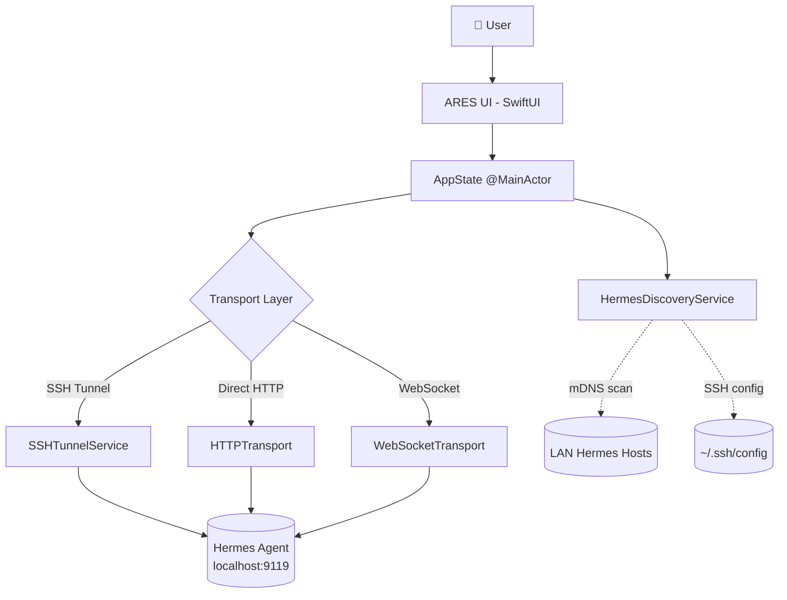
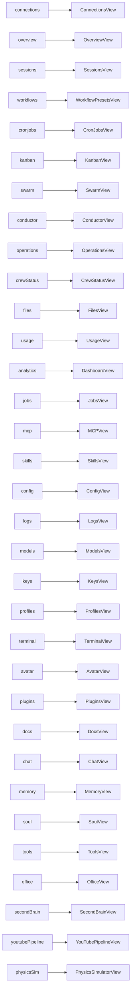
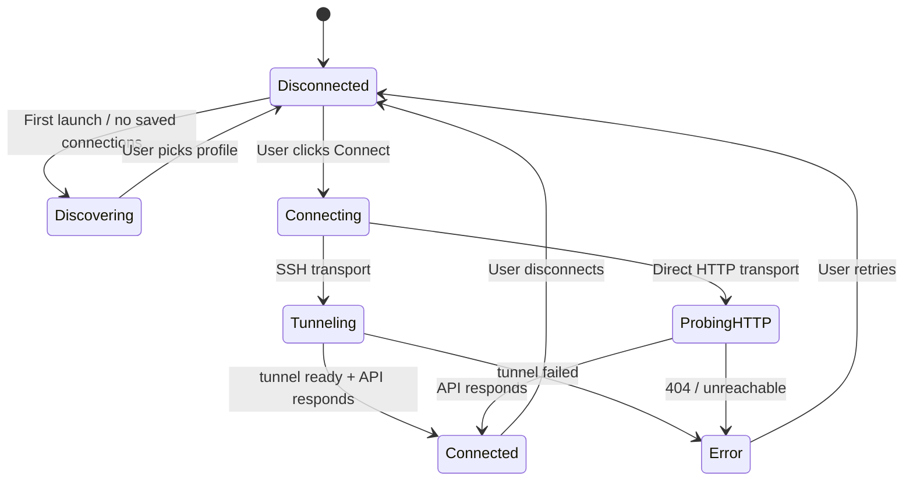
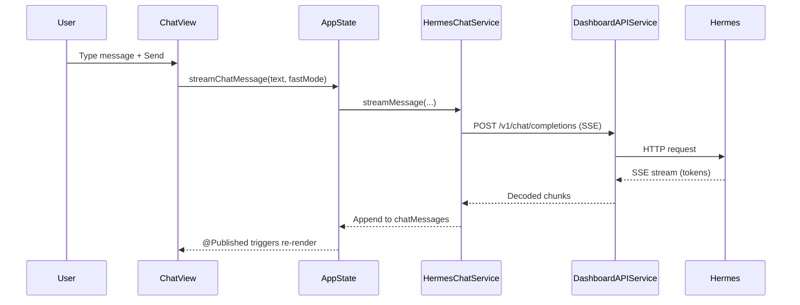

# ARES Desktop Architecture

This document describes how the ARES macOS SwiftUI app is structured, how it talks
to a Hermes Agent, and how the pieces fit together. Diagrams below render
natively on GitHub via Mermaid.

For a user-friendly walkthrough of getting connected, see
[CONNECTING.md](CONNECTING.md).

---

## 1. High-level component graph



`AppState` is the single `@MainActor` `ObservableObject` that owns every
published UI value (selections, loading flags, errors, models). Views observe
`AppState`; feature services (e.g. `HermesChatService`, `DashboardAPIService`)
push results back into `AppState` properties to trigger re-renders.

---

## 2. Tab to View routing

Every `AppSection` case routes to exactly one top-level View. The sidebar list
in `RootView` shows these in order; the actual selection drives
`nonSessionDetailContent` (Sessions is overlaid for fast-switching).



Source of truth: `Views/RootView.swift` — `nonSessionDetailContent` switch and
`availableSections` array.

---

## 3. Connection lifecycle state machine



`Connecting → Tunneling` is implemented by `SSHTunnelService`, which spawns
`ssh -N -L <localPort>:127.0.0.1:9119 <host>` and polls until the local port
answers (10s timeout). `Connecting → ProbingHTTP` skips SSH entirely and hits
the Dashboard API at the host directly.

---

## 4. Data flow for sending a chat message



Because `AppState` is `@MainActor`, every mutation that views observe must
happen on the main actor. Streaming services hop back to `@MainActor` before
appending tokens.

---

## 5. Folder structure

```
ARES-Desktop/Sources/HermesDesktop/
├── App/                 App entry point, AppState (split across extensions per feature)
│   ├── HermesDesktopApp.swift          SwiftUI @main, scene config
│   ├── AppState.swift                   Core @MainActor ObservableObject
│   └── AppState+*.swift                 Feature-scoped extensions (Chat, Connections, …)
├── Models/              Plain data types and enums
│   ├── AppSection.swift                 Sidebar tab enum (drives routing)
│   ├── ConnectionProfile.swift          Saved connection (SSH alias, host, profile name)
│   ├── RemoteDiscovery.swift            Discovered Hermes hosts payload
│   └── *Models.swift                    Per-feature model bundles
├── Services/            Transport, SSH, API, and feature services
│   ├── SSH/                             SSH process lifecycle, tunnel orchestration
│   ├── Transport/                       HTTP/SSH/WebSocket transport abstraction
│   ├── Storage/                         Local on-disk persistence
│   ├── HermesDiscoveryService.swift     mDNS + SSH config + localhost discovery
│   ├── ConnectionInviteService.swift    Generate / accept invite codes
│   ├── DashboardAPIService*.swift       Hermes dashboard HTTP API client
│   ├── HermesChatService.swift          SSE chat streaming
│   └── *.swift                          Per-feature browsers (Sessions, Skills, Files…)
├── Views/               SwiftUI views grouped by section
│   ├── RootView.swift                   Sidebar + detail routing
│   ├── Connections/                     Discovery, profile editor, invite UI
│   ├── Chat/ Sessions/ Kanban/ …        One folder per AppSection
│   └── Shared/                          Reusable layout primitives
├── Utilities/           Formatters, localization, command quoting
└── Resources/           Bundled assets, Python SSH bridge script
```

---

## Transport modes

ARES picks one of three transports per connection profile. The choice is stored
on the profile and reflected by `ConnectionProfile.transportKind`.

| Mode | When to use | What happens |
|---|---|---|
| **SSH tunnel** | Hermes is on a different machine you reach over SSH (incl. `localhost` via local SSH) | `SSHTunnelService` spawns `ssh -N -L <port>:127.0.0.1:9119 host`, then HTTP/SSE go through the tunnel. Also gives access to the SSH-bridge Python RPC for filesystem-heavy features (Sessions, Skills, Files, Soul). |
| **Direct HTTP** | Hermes is reachable on a routable address (LAN, VPN, Tailscale) and the dashboard port is exposed | `HTTPTransport` talks straight to `http(s)://host:9119`. No SSH required. Filesystem-bridge features unavailable. |
| **WebSocket** | Long-lived streams (chat, logs, swarm) when the dashboard advertises a WS endpoint | `WSTransport` upgrades a connection for bidirectional streaming; falls back to SSE over the same tunnel/HTTP if not available. |

The SSH tunnel mode is the default for new connections and the only one that
unlocks the Python RPC bridge.

---

## Discovery tiers

`HermesDiscoveryService` tries these in order on first launch and whenever the
Connections tab refreshes:

1. **Localhost probe** — try `127.0.0.1:9119` directly; if Hermes is on this
   Mac, the user can connect with zero config.
2. **Bonjour / mDNS** — browse `_hermes._tcp.` services on the LAN. Any host
   broadcasting itself shows up as a one-click profile.
3. **SSH config** — parse `~/.ssh/config` for `Host` blocks; entries that look
   like Hermes hosts (or are explicitly tagged) are offered as profiles.

The user can override any tier and paste an explicit host or invite code.

---

## Invite codes

Sharing a working connection is done with an **invite code**:

- Generated by `ConnectionInviteService` from a `ConnectionProfile`.
- Payload is a small JSON object: `{label, host, port, user, transport, hermesProfile, hint}`.
- Encoded as **base64url** (URL-safe base64, no padding) so it can be pasted
  into iMessage, email, or a QR code without escaping.
- The recipient pastes the code in `Connections → Paste Invite Code`. ARES
  decodes it, materializes a draft `ConnectionProfile`, and runs the normal
  connect flow. Secrets (private keys) are never embedded; the recipient must
  still have valid SSH auth to the target host.

---

## @MainActor isolation rule

`AppState` and every type that mutates published UI state is annotated
`@MainActor`. Concretely:

- Long-running work (SSH I/O, HTTP requests, SSE decoding) runs on background
  tasks via `Task.detached` or service-owned executors.
- Before writing to any `@Published` property on `AppState`, code hops back to
  the main actor (`await MainActor.run { ... }` or by being called inside an
  already-`@MainActor` method).
- Views never call services directly; they always go through `AppState`. This
  keeps the data-flow direction one-way: View → AppState → Service → AppState
  (`@Published`) → View.

Violating this rule produces Swift 6 concurrency warnings and, in practice,
flickering or stale UI under load. When in doubt, the method belongs on
`AppState`.
