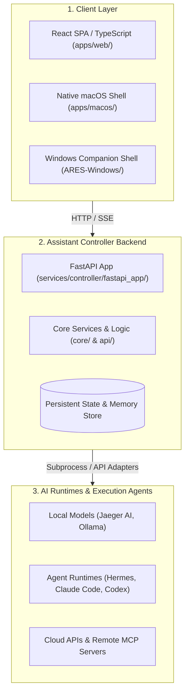
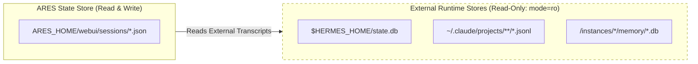
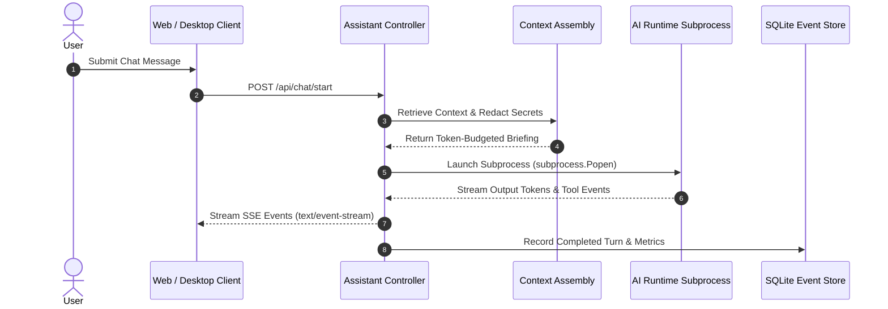

# System Architecture & Design

| Attribute | Details |
| :--- | :--- |
| **Status** | Canonical System Reference |
| **Audience** | Maintainers, System Engineers, AI Engineers |
| **Last Updated** | July 2026 |

This document describes the machine architecture of ARES: process topology, system boundaries, decoupled state storage models, context assembly, and turn orchestration.

---

## 1. Process Topology

The ARES platform consists of a three-tier architecture: the Client Layer, the Assistant Controller Backend, and Pluggable AI Runtimes.

```mermaid
flowchart TD
    subgraph Client ["1. Client Layer"]
        ReactUI["React SPA / TypeScript (apps/web/)"]
        MacUI["Native macOS Shell (apps/macos/)"]
        WinUI["Windows Companion Shell (ARES-Windows/)"]
    end

    subgraph Controller ["2. Assistant Controller Backend"]
        FastAPI["FastAPI App (services/controller/fastapi_app/)"]
        CoreLogic["Core Services & Logic (core/ & api/)"]
        SQLiteDB[(Persistent State & Memory Store)]
    end

    subgraph Runtimes ["3. AI Runtimes & Execution Agents"]
        LocalModels["Local Models (Jaeger AI, Ollama)"]
        AgentRuntimes["Agent Runtimes (Hermes, Claude Code, Codex)"]
        CloudAPIs["Cloud APIs & Remote MCP Servers"]
    end

    Client -->|HTTP / SSE| Controller
    Controller -->|Subprocess / API Adapters| Runtimes
```

### Layer Responsibilities

1. **Client Layer (`apps/web/`, `apps/macos/`)**: Single-page application presenting the user interface. Normalizes all backend API payloads through a strict contract translator (`apps/web/src/shared/translators.ts`).
2. **Assistant Controller (`services/controller/`)**: FastAPI application server handling request identity, authentication, session lifecycle, task planning, and context assembly.
3. **AI Runtimes (`integrations/workers/`, `api/backends/`)**: External AI models and agent frameworks invoked as isolated subprocesses or API clients.

---

## 2. Decoupled Read-Only State Storage

ARES enforces a strict one-way state isolation pattern between the platform store and external AI runtimes:

```mermaid
flowchart LR
    subgraph ARESStore ["ARES State Store (Read & Write)"]
        ARESSessions["ARES_HOME/webui/sessions/*.json"]
    end

    subgraph ExternalStores ["External Runtime Stores (Read-Only: mode=ro)"]
        HermesDB["$HERMES_HOME/state.db"]
        ClaudeDB["~/.claude/projects/**/*.jsonl"]
        JaegerDB["<jaeger>/instances/*/memory/*.db"]
    end

    ARESStore -->|Reads External Transcripts| ExternalStores
    style ExternalStores stroke-dasharray: 5 5
```

> [!IMPORTANT]
> **State Isolation Guarantee**
> ARES never mutates external runtime databases. External databases are opened strictly in read-only mode (`?mode=ro`). When an AI runtime finishes a turn, it records state within its own internal database, while ARES maintains its authoritative task and session state in `ARES_HOME`.

---

## 3. Component Boundaries & Responsibilities

| System Component | Component Owner | Responsibilities |
| :--- | :--- | :--- |
| **Identity & Policy** | Platform Controller | User profile, system behavior, data privacy rules, authorization gates. |
| **Persistent Memory** | Platform Controller | Event log, searchable message history (SQLite FTS5), task repository. |
| **Context Assembly** | Platform Controller | Context retrieval, token budget packing, sensitive data redaction. |
| **Turn Execution** | AI Runtimes | Model inference, tool call invocation, code execution loops. |
| **Output Evaluation** | Platform Controller | Verification of runtime output, tool response validation, event recording. |

---

## 4. Turn Orchestration & Chat Execution Flow

When a user submits a message, execution follows a standard request-response pipeline:

```mermaid
sequenceDiagram
    autonumber
    actor User
    participant Client as Web / Desktop Client
    participant Controller as Assistant Controller
    participant Engine as Context Assembly
    participant Runtime as AI Runtime Subprocess
    participant Storage as SQLite Event Store

    User->>Client: Submit Chat Message
    Client->>Controller: POST /api/chat/start
    Controller->>Engine: Retrieve Context & Redact Secrets
    Engine-->>Controller: Return Token-Budgeted Briefing
    Controller->>Runtime: Launch Subprocess (subprocess.Popen)
    Runtime-->>Controller: Stream Output Tokens & Tool Events
    Controller-->>Client: Stream SSE Events (text/event-stream)
    Controller->>Storage: Record Completed Turn & Metrics
```

### Execution Steps
1. **Request Ingestion**: The client issues `POST /api/chat/start` with user message and session parameters.
2. **Context Assembly**: The platform queries FTS5 memory, applies privacy redaction rules, and compiles a token-budgeted prompt briefing.
3. **Subprocess Dispatch**: The runtime adapter launches the elected AI runtime process via `subprocess.Popen` (appending `--resume <session_id>` for turn continuation).
4. **Server-Sent Events (SSE)**: Standard I/O output is parsed into structured SSE events (`token`, `tool_call`, `error`, `done`) and streamed to the client via `/api/chat/stream`.
5. **Turn Completion**: Session state, duration metrics, and event records are saved to `ARES_HOME/webui/sessions/`.

---

## 5. Architecture Decisions

These decisions replace the retired ADR directory. They are part of the
canonical architecture and should be changed only through an intentional
architecture review.

### Workers execute out of process

ARES supports independently versioned workers such as Jaeger AI, Hermes,
Claude Code, Codex, Ollama, and cloud providers. ARES invokes workers through
subprocess or network adapters; it does not import or absorb their execution
loops. A worker crash, dependency conflict, or memory failure must not take
down the controller.

Conversation continuation is performed through the worker's supported resume
contract. ARES sends the new turn and asks the worker to resume its own session
instead of rewriting or replaying the worker's private state. A warm-worker
daemon may be introduced later if measured startup latency justifies it, but
the process and ownership boundary remains.

### ARES and workers own separate stores

ARES reads and writes its own journal, tasks, artifacts, approvals, and profile
state. Each worker owns its native sessions, scratchpads, model state, and
configuration. ARES may import worker history using read-only access, but it
never writes directly to another application's database.

This boundary preserves worker portability, prevents database and WAL
contention, and keeps provenance intact. Continuing a worker session means
asking that worker to append the turn through its adapter.

### Read-only describes continuation capability

The `read_only` session flag means ARES has no safe append or resume path for
that session. It does not merely mean the session originated outside ARES.
Imported sessions remain continuable when their worker exposes a supported
resume operation; transcript-only imports remain read-only and reject mutation.

### Clients consume ARES contracts

Framework-native payloads are normalized at the controller or client boundary.
React components and native surfaces consume ARES-owned contracts and must not
branch on framework display strings. Backend IDs are machine identifiers;
labels are presentation metadata. Compatibility aliases are normalized before
they enter application state.

For the Web UI, contracts live in `apps/web/src/shared/contracts.ts` and raw
payload translation lives in `apps/web/src/shared/translators.ts`.

### Chat streaming uses Server-Sent Events

Chat is predominantly server-to-client streaming, so SSE remains the canonical
transport for tokens, tool activity, errors, and completion. Starting,
cancelling, approving, and clarifying are ordinary authenticated HTTP requests.
This keeps the protocol compatible with browsers, WKWebView, reverse proxies,
and trusted private networking without a separate WebSocket authentication
path.

WebSockets may support genuinely bidirectional features such as live audio,
but they do not replace the canonical chat stream without a new product and
architecture decision.

---

## 6. Runtime Invariants

- ARES never silently selects a worker on a new profile.
- Profile readiness and execution readiness are reported separately.
- Backend selection, model selection, and tool selection remain distinct.
- New backend state uses canonical IDs; legacy IDs are accepted only at input
  migration boundaries.
- Every completed turn retains worker and model provenance when available.
- External stores are opened read-only and never acquire ARES-created journals
  or lock files.

## 7. External Agent Source Boundary

The controller currently has compatibility paths that can discover and import
parts of an external Ares Agent checkout. The dependency audit in
`services/controller/scripts/audit_agent_source_dependencies.py` tracks the
remaining startup installs, runtime imports, state access, provider access, and
container source mounts for issue #2491.

The target contract is a versioned HTTP/client boundary. Agent-owned sessions,
credentials, provider routing, and execution stay behind agent APIs; ARES keeps
presentation, request validation, and its own durable state. Pure schemas and
constants may move into a small versioned client package. The existing source mounts can be removed only after every audited runtime dependency has an API or
client replacement and the migration tests prove equivalent behavior.

## 8. Canonical Session Resolution

Every URL route, query parameter, `localStorage` restore value, and sidebar
selection must resolve to one `canonical_visible_session_id` before a
conversation is rendered. Compression lineage is metadata, not an alternate
navigation system: `pre_compression_snapshot`, `continuation_session_id`, and
`parent_session_id` are resolved through the same helper.

The two required entry points are a direct session open and browser boot restore.
Both produce the canonical visible session, the continuation target,
and the parent lineage without allowing stale browser state to override an
explicit route.
