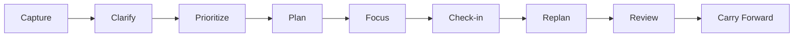

# Product Specification

| Attribute | Details |
| :--- | :--- |
| **Status** | Canonical Product Specification |
| **Audience** | Developers, System Architects, Integration Engineers |
| **Owner** | ARES product maintainers |
| **Last verified** | 2026-08-01 |
| **Source of truth** | Product surfaces, feature specifications, and acceptance tests |
| **Platform** | macOS and Web; additional native clients are planned |

This document defines the product architecture, core system capabilities, and personal organizer specifications for the ARES platform.

---

## 1. Product System Overview

ARES is a multi-surface platform hosting a persistent Synthetic Intelligence experience. The platform acts as a local-first control plane between the user and digital tools — maintaining context, enforcing data security rules, managing daily focus schedules, and delegating execution to pluggable AI runtimes without allowing external models to mutate state without authorization.

### Why ARES

An LLM by itself predicts a response but does not own durable identity, memory,
permissions, tools, or verification. ARES supplies those stable layers around
replaceable local and cloud models. The result is one continuous Synthetic
Intelligence that can remember the user, act through explicit capabilities,
show its work, and verify outcomes without tying the product to one model or
worker. This separation is what makes ARES a personal assistant rather than a
framework-branded chat client.

Feature-level behavior and implementation status live under
[`docs/features/`](features/README.md). The active SI Settings contract is
[`features/si-personalization.md`](features/si-personalization.md).

---

## 2. Personal Organizer Capability Specification

### System Capabilities
ARES provides an integrated task management and daily planning engine that captures obligations, generates deterministic schedule plans, tracks live focus sessions, replans during schedule shifts, and preserves state across application restarts.

### Core Daily Workflow

### Core Functional Capabilities

1. **Obligation Capture**: Quick task capture via text or voice directly into the Inbox.
2. **Deterministic Daily Planning**: Automatic daily plan generation from task estimates, calendar availability, priorities, and routine rules.
3. **Interactive Schedule Management**: Real-time schedule reordering, deferral, completion, and cancellation.
4. **Schedule Replanning**: Automatic schedule recalculation when calendar events move or task durations change.
5. **Carry-Forward Engine**: Explicit migration of uncompleted work to future dates without silent data loss.
6. **Persistence & Restart Recovery**: State recovery of focus state, active plans, and task records across system restarts.

---

## 3. Product System Architecture & Scope

### Task Foundation & Storage
- Full task lifecycle (CRUD operations, Inbox triage, project grouping, due dates, priority tiers).
- Persistent JSON/SQLite storage in `{ARES_HOME}/webui_state/tasks.json`.
- REST API routing via `/api/organizer/*` endpoints and web quick-capture components.

### Daily Planning Engine
- Deterministic time-block allocation algorithm (priority-ordered time slot assignment).
- System calendar integration (macOS Calendar read events).
- Workload calculation and overcommitment detection.

### Voice & Natural Language Integration
- Natural language task parsing and clarification.
- System voice capture, plan summaries, and hands-free task management.
- Offline-first local execution for core task and schedule operations.

---

## 4. Product Surfaces and Ownership

ARES is one product with native and web clients over the same controller
contracts. Surfaces organize user intent; they are not separate agents or
framework-branded applications.

| Surface | Responsibility |
| :--- | :--- |
| **Agent** | The continuous conversation, sessions, approvals, and visible execution activity. |
| **Engineering** | Code, terminal, simulation, design, and technical project work. |
| **Studio** | Image, video, audio, 3D, and other creative production workflows. |
| **Life** | Tasks, routines, goals, schedules, and personal organization. |
| **Library** | User-owned knowledge, documents, collections, and artifacts. |
| **Control Center** | Connections, infrastructure, health, memory policy, permissions, and autonomy. |
| **Settings** | Personal presentation and application preferences; a utility destination, not a seventh environment. |

The Companion is the continuous Synthetic Intelligence experience hosted by
ARES. Workers such as Jaeger AI, Hermes, Ollama, Claude, and Codex execute
turns but do not become the product identity. Changing a worker must not rename
the Companion, move the session, or change the navigation model.

## 5. Readiness Model

- **Profile ready:** identity and application preferences are saved.
- **Connection ready:** at least one configured worker responds to its health
  contract.
- **Execution ready:** a connected worker satisfies the requested capability.

The interface must report these states independently. A profile without a
worker is valid, but the product must not claim it can execute work until an
appropriate connection is available.
